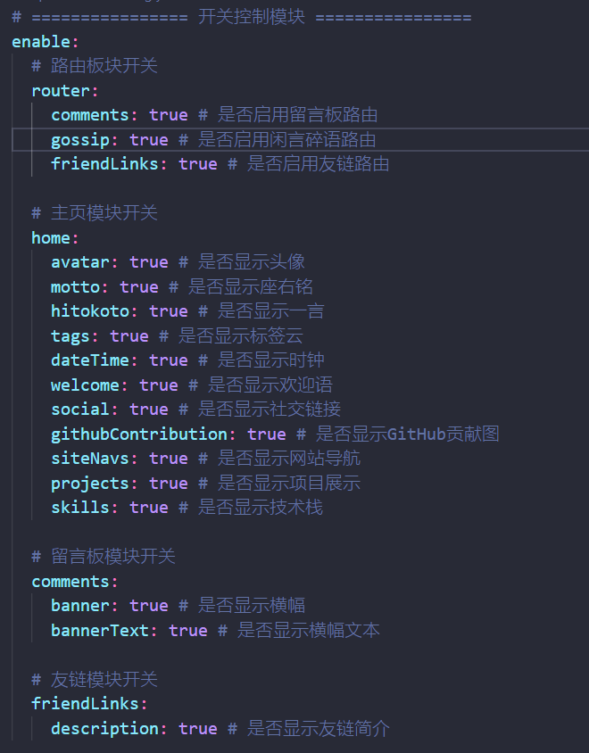
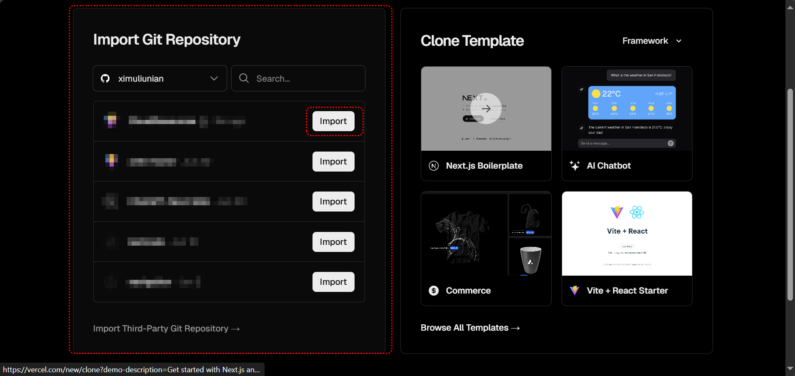

# X - HOME

这个项目的诞生是因为网络上找不到心仪的主页，总觉得跟预期稍有偏差 (⊙x⊙;)。刚好咱有那么一点点的前端能力，嗦以决定自己写一个……
o((>ω< ))o

项目使用 Vue3 + Vite 构建，克隆下来后可以现在本地跑一下试试看

安装依赖：`pnpm install`

运行项目：`pnpm run dev`

项目构建：`pnpm run build`

克隆下来之后得先安装一下依赖，然后根据自己的需求改配置文件。配置文件都是在根目录下面。

## 如何使用

> 前置条件：需要安装 Git 环境

首先在本地创建一个目录（这里暂且叫它 root），然后在目录下执行以下命令

```bash
# 初始化项目
git init

# 拉取本项目为子模块
git submodule add https://github.com/ximuliunian/x-home.git x-home

# 初始化和更新子模块
git submodule update --init --recursive
```

> 如果本项目更新了，但是子模块是不会自己更新的，需要手动更新子模块
>
> ```bash
> # 更新子模块（尝试合并）
> git submodule update --remote --merge CloudExplorer
> 
> # 如果你在子模块中有本地修改或提交，使用以上命令不会被丢弃，而是尝试自动合并
> # 如果合并失败，你可能需要手动解决冲突，如果不想或者不会解决冲突，你可以使用以下命令
> # 强制更新子模块（丢弃本地修改和提交）
> git submodule update --remote CloudExplorer
> ```
>
> 每次更新子模块之前需要先来本仓库中查看一下是否对配置做了更新，该怎么配置这些更新的内容。做好准备后再更新子模块

然后再根目录（root）中创建一个以下结构的目录和文件

```txt
root:
│  .env # 站点配置
│
├─.github
│  └─workflows
│          main.yml	# GitHub 贪吃蛇贡献图生成脚本
│
├─x-home  # 子模块目录
│      ......
│
├─public
│  ├─img
│  │  │  ...
│  │  │  favicon.ico # 网站图标
│  │  │  ...
│  │  │
│  │  └─background	# 背景图片
│  │          1.png
│  │		  ...
│  │
│  └─js
│          icon.js	# 展示图标
│
└─source
    │  Configuration.js	# 主配置文件
    │  FriendLinks.js	# 友链配置
    │  GossipConfiguration.js	# 闲言碎语配置
    │
    ├─friendLink # 友链
    │	...
    │
    └─gossip # 闲言碎语
		...
```

至此准备工作就完成了，接下来进行配置项目

> 创建的文件名和文件夹名称一定要一样（包括大小写）

## 配置文件（.env）

位置在根目录下，这里面存放的是站点的基本信息 (●'◡'●)

``` env
# 站点logo
VITE_FAVICON = "/img/favicon.ico"
# 站点标题
VITE_TITLE =
# 站点描述
VITE_DESCRIPTION =
# 站点关键字
VITE_KEYWORDS =
```

---

> 以下所有的配置文件或者会用到的文件都可以在 `x-home(子目录) > template` 文件夹中找到

## 配置文件（Configuration.js）

这里面存放就是展示的信息了 (￣y▽,￣)╭ ，文件里面基本都有注释，看着改就行了，下面挑一些需要说的

### 开关

有这么一个配置，它里面可以控制页面元素是否进行展示。像下图，如果把 `avater` 设置为 `false` 那么头像将不会再页面上进行渲染



### 静态资源

一般所填充的静态资源都是存在于 `public` 文件夹下面，设置静态资源相对路径的时候 `/` 代表 `public` 文件夹，`/`
后面的路径是相对于 `public` 文件夹的，比如要设置的是 `public` 文件夹下面的 `img` 文件夹，那么就是 `/img`

### 社交链接

这个就谈谈 `info` 中的配置：

```javascript
{
    name: 'GitHub',
    icon: 'icon-GitHub',
    url: 'https://github.com/ximuliunian'
}
```

name：展示的名字

icon：iconfont图标库软件，[#具体点我](#图标选择)

url：这是点击按钮需要跳转的链接

### 站点内部

参考社交链接……

### 技术栈

这个是用的 skillicons 这个项目

官网：https://skillicons.dev

GitHub：https://github.com/tandpfun/skill-icons

GitCode：https://gitcode.com/gh_mirrors/sk/skill-icons

这个项目收录了很多常用的技术栈图标，具体有什么图标可以通过上面的链接查看一番（建议使用GitCode国内快）。具体详情什么的这里不做赘述。使用的时候进入项目找到图标对应的关键字，如下图：


然后把关键字加入 list 配置中即可

### 图标选择

在配置社交链接或者其他地方会看到 `icon`的配置（avatar_status里面的不算），图标可以去 [iconfont](https://www.iconfont.cn)
中进行挑选，步骤如下：

1. 进入 [iconfont](https://www.iconfont.cn) 选择需要的图标添加入库，选择完之后添加到项目中（没有就创建一个）
    - 创建项目：其他都随意，字体格式 彩色、WOFF、WOFF2、TTF 都选上然后点新建

      

2. 添加到项目中后修改一下图标名字什么的，然后点击项目名称下面的三个选项中的 Symbol 选项，之后下面会出现一个链接

   

3. 进入到链接内复制里面全部的内容然后找到本项目的 `public/js/icon.js` 文件，把复制的内容替换掉文件中的内容
   
4. 最后在需要使用图标的地方的 icon 选项内使用自己的即可

``` javascript
{
    name: 'bilibili',
    url: 'https://space.bilibili.com/1304924540',
    icon: 'icon-bilibili'
}
```

### ICP 备案

这个因为我有这个需求，在对应的站点展示或者不展示对应的ICP号。`domain` 里面填写顶级域（如：`xxx.com`），后面的 `info` 填写对应的备案号

## 评论配置

这个项目的评论系统我是集成的 Giscus 这个项目，它的原理就是利用 GitHub
的 [Discussions](https://docs.github.com/cn/discussions) 功能，这里不做过多的赘述，可以自行查找资料。使用的时候跟着他的官网内的教程就可以了。

官网：[giscus.app](https://giscus.app/zh-CN)

首先你得有创建一个公共仓库，如果你有仓库的话不创建也行，只要你的仓库是公共的即可。然后你得需要保证你的 GitHub 安装了它的插件

插件地址：[github.com/apps/giscus](https://github.com/apps/giscus)

安装好之后进入插件的配置，里面有一个 Repository access 的选项，到时候看着选一下


第一个选项是所有仓库都可以使用这个插件，第二个选项是指定的仓库可以使用，看着选就行了。选完仓库后进入他的官网填写它的所需的内容


选完之后划拉到最下面的 `启用 giscus` 的选项下，会看到下图内容，只需要把红框内的内容依次复制到配置文件中的配置中即可


data-repo = 仓库
data-repo-id = 仓库ID
data-category = 分类
data-category-id = 分类ID

## GitHub贪吃蛇贡献图

```yaml
name: Generate Contribution Grid Snake

on:
  schedule:
    - cron: "0 */6 * * *"
  workflow_dispatch:
  push:
    branches:
      - main

jobs:
  generate:
    runs-on: ubuntu-latest
    timeout-minutes: 10

    steps:
      # 1. 检出 main 分支最新代码
      - name: Checkout main branch
        uses: actions/checkout@v3
        with:
          fetch-depth: 0

      # 2. 生成蛇形贡献图
      - name: Generate github-contribution-grid-snake.svg
        uses: Platane/snk@v3
        with:
          github_user_name: ${{ github.repository_owner }}
          outputs: ./public/img/github-contribution.svg

      # 3. 强制推送整个项目到 output 分支
      - name: Push to output branch
        run: |
          git config --global user.name "github-actions[bot]"
          git config --global user.email "github-actions[bot]@users.noreply.github.com"
          git add .
          git commit --allow-empty -m "Update: ${{ github.run_id }}"
          git push origin HEAD:output --force
        env:
          GITHUB_TOKEN: ${{ secrets.GITHUB_TOKEN }}
```

复制以上的脚本到 `.github > workflows > main.yml` 文件中，什么都不用动什么都不用改，上传到GitHub即可使用。它的执行流程就是每当当前仓库有提交的时候会执行一次，然后就是会在每周一早上八点执行一次。

它执行完成后会提交一个 svg 文件（`github-contribution.svg`）到 `public/img/` 目录下

> 注意：
>
> 1. 贡献图只能在 GitHub 中使用生成
> 2. 使用这个得修改一下 Workflow 权限，不然会执行失败
> 3. 以上以上内容最终会输出到 output 分支上
>
> 修改权限：依次点击仓库的 Settings -> Actions -> General 拉到最下面 找到 "Workflow permissions" 选择 Read and write
> permissions 点击保存

## 配置文件（ GossipConfiguration.js ）

这个配置文件中存放的是闲言碎语中的配置内容，其中有两个主要的配置

第一个是设置，它是用来管理你自己书写的内容的展示和拉取权限的

第二个是关联链接，如果有别人也使用了该项目，并且他也书写了闲言碎语的内容，那么你只需要把他的网站域名添加到该配置中即可拉取他的闲言碎语内容

### 闲言碎语书写

在根目录中的 `config` 的文件夹中有 `gossip` 文件夹，请在那里面创建一个 `json` 文件即可，文件名称自定义，但在文件中按照下方模板填写内容

```json
{
  "info": {
    "id": "（yyyy/MM/dd）-（今天的第几条内容）：2024.12.19-0"
  },
  "date": "（yyyy/MM/dd）：2000/01/01",
  "content": [
    "p:今天是个好天气，但是不是一个好日子……"
  ]
}
```


对于 `content` 中书写内容的前缀在以下表格中，对于展示内容需要使用一些简单的语法格式，项目会自动编译成 HTML 代码，目前所支持的格式有

| 格式      | 标签                                         |
| --------- | -------------------------------------------- |
| "h1:xxx"  | 一级标题                                     |
| "h2:xxx"  | 二级标题                                     |
| "h3:xxx"  | 三级标题                                     |
| "p:xxx"   | 正常文本                                     |
| "img:xxx" | 图片内容，xxx 为图片链接（也可以是相对路径） |
| "ol:xxx"  | 有序列表                                     |
| "ul:xxx"  | 无序列表                                     |

例子：

```js
{
    ...
    content: [
    	"p:今天是个好日子",
     	"p:希望明天不要是一个坏天气",
       	"img:xxxxxxx"
    ]
    ...
}
```

## 配置文件（ FriendLinks.js）

这个是友人帐（友链）的配置文件。这个配置中有两个模块分别控制着友链界面的介绍内容和分类

```js
export const friendLinks = {
    apply: {
        description: [
            "p:使用本站特定语法书写介绍内容"
        ],
        scheme: {
            name: "昵称",
            url: "本站链接",
            avatar: "头像",
            desc: "个人介绍或者座右铭",
            bgColor: "背景颜色"
        },
        require: [
            "p:使用本站特定语法书写要求内容"
        ],
    },
    links: [
        {
            sort: "分类名-1",
            icon: "icon-xxx"
        }, {
            sort: "分类名-2",
            icon: "icon-xxx"
        }
    ]
}
```

`apply` 主要控制着展示的内容在这里面最需要说的就是 `scheme` 内容。它是用来帮助交换友链的，这里面填写本站信息，然后别人就可以根据这些信息填写友链

然后就是 `links` 这个里面放着的是友链的分类这个没什么说的要多少分类添加多少即可

### 添加友链

在配置文件夹（config）下有一个 `friendLink` 的文件夹，在这个文件夹中创建 JSON 文件按照以下格式，那么在构建项目的时候会自己生成对应的信息。格式如下：

```json
{
  "sorts": "测试",
  "name": "曦暮流年",
  "url": "https://www.ximuliunian.top",
  "avatar": "https://www.ximuliunian.top/img/avatar.png",
  "desc": "懒惰往往是创新的催化剂",
  "bgColor": "#8bfdd4"
}
```

| 字段    | 是否必填 | 介绍                                                         |
| ------- | -------- | ------------------------------------------------------------ |
| sorts   | 否       | 当前友链的分类，填写分类名即可（就是在配置文件中写的分类名）。<br />如果不写或者写的分类配置文件中没有那么都会归类到 “小伙伴们” 一栏 |
| name    | 是       | 昵称                                                         |
| url     | 是       | 网站链接                                                     |
| avatar  | 是       | 头像链接                                                     |
| desc    | 是       | 介绍或者座右铭                                               |
| bgColor | 否       | 友链卡片背景颜色                                             |

按照以上信息在目录中创建对应json文件即可

- json文件随便命名没有要求
- 可以创建多个文件夹，如：`friendLink > dir1`、`friendLink > dir2` 目录的深度不会影响友链的展示

## Vercel 部署

> 不管通过什么部署，选项中项目的根目录一定要是拉取的 Git 的子模块，因为存在自动生成 GitHub 贡献图的原因，最终部署代码的时候分支一定要选 output
>
> 部署之前把内容代码上传到 GitHub

通过 GitHub 登录之后进入主页面


点击 Add New... >> Project



在以上位置选择对应的存储库，然后点击 `Import`，进入以下页面


之后找到红框框选的部分，这里就是决定项目根目录的。点击 `Edit` 选择对应的目录，然后上面的 `Framework Preset` 应该会自己变为 `Vite`

> 如果找不到对应的子模块文件夹，直接部署即可。到之后去部署项目的设置中手动填写子模块名称


如果没变则需要手动选择，然后选择下面的 `Build and Output Settings` ，按照下如填写


至此 Vercel 部署完成，其他的部署方式，比如 `Cloudflare Pages` 跟 Vercel 部署一样，都是需要设置一下根目录和构建方式
